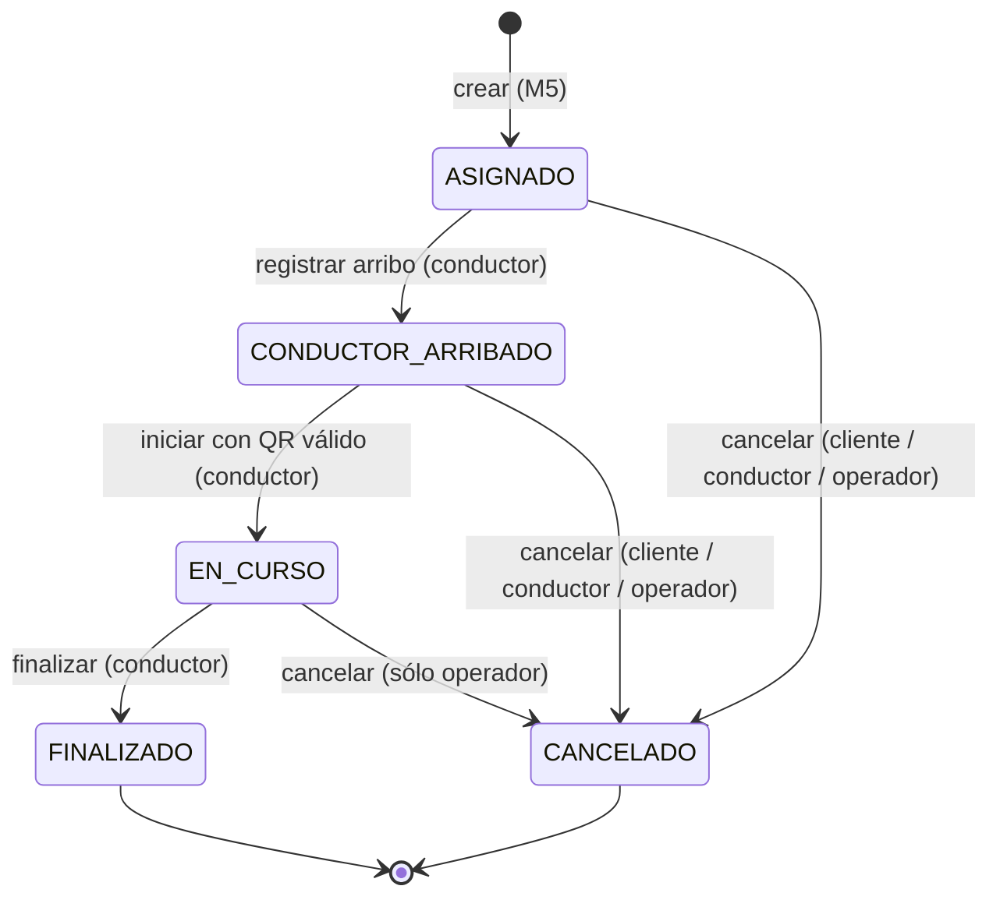

# M6 – Máquina de estados del viaje

> Cubre RF-6.1 (estados y transiciones), RF-6.3 a RF-6.7 (arribo, inicio, finalización y
> cancelaciones) y RF-6.8 (historial no destructivo).
> La implementación de referencia está en
> [`m6-viajes/src/viajes/dominio`](../../m6-viajes/src/viajes/dominio).

## Alcance del módulo

Un **viaje** nace cuando M5 (Solicitud y Despacho) ya resolvió la asignación única de un
conductor. Todo lo anterior (búsqueda de candidatos, ofertas, aceptación) es de M5. Todo lo
posterior al cierre (cobro, comprobante, calificaciones) lo hacen otros módulos reaccionando
a los eventos que publica M6.

```
M5 asigna conductor ──POST /viajes──▶ M6 administra el ciclo de vida ──eventos──▶ M7, M8, M5, M2/M3, M4, M9
```

## Estados

| Estado               | Significado                                                       | ¿Terminal? |
|----------------------|-------------------------------------------------------------------|:----------:|
| `ASIGNADO`           | Hay conductor asignado y se dirige al punto de retiro.            | No         |
| `CONDUCTOR_ARRIBADO` | El conductor indicó que llegó al punto de retiro y espera.        | No         |
| `EN_CURSO`           | Se validó el código QR y el cliente está a bordo.                 | No         |
| `FINALIZADO`         | El conductor cerró el viaje con distancia y duración.             | Sí         |
| `CANCELADO`          | Lo canceló el cliente, el conductor o un operador (con motivo).   | Sí         |

## Diagrama



## Tabla de transiciones

| Acción             | Desde                              | Hacia                | Quién puede                       | Precondiciones                                                         | Evento publicado     |
|--------------------|------------------------------------|----------------------|-----------------------------------|------------------------------------------------------------------------|----------------------|
| crear              | —                                  | `ASIGNADO`           | Servicio M5                       | `asignacionId` no usado antes; no hay otro viaje activo para la solicitud. | `ViajeCreado`        |
| registrar arribo   | `ASIGNADO`                         | `CONDUCTOR_ARRIBADO` | Conductor asignado                | —                                                                      | `ConductorArribado`  |
| iniciar            | `CONDUCTOR_ARRIBADO`               | `EN_CURSO`           | Conductor asignado                | Código QR válido, vigente y no usado (lo valida M8; ver RF-6.4).        | `ViajeIniciado`      |
| finalizar          | `EN_CURSO`                         | `FINALIZADO`         | Conductor asignado                | Informa `distanciaRecorridaMetros` ≥ 0.                                | `ViajeFinalizado`    |
| cancelar           | `ASIGNADO`, `CONDUCTOR_ARRIBADO`   | `CANCELADO`          | Cliente del viaje                 | Motivo permitido para clientes.                                         | `ViajeCancelado`     |
| cancelar           | `ASIGNADO`, `CONDUCTOR_ARRIBADO`   | `CANCELADO`          | Conductor asignado                | Motivo permitido para conductores (ver espera mínima).                 | `ViajeCancelado`     |
| cancelar           | `ASIGNADO`, `CONDUCTOR_ARRIBADO`, `EN_CURSO` | `CANCELADO` | Operador                          | Motivo permitido para operadores.                                       | `ViajeCancelado`     |

Cualquier otra combinación de acción y estado se rechaza con `409 TRANSICION_INVALIDA`, y
una acción hecha por quien no corresponde se rechaza con `403 PROHIBIDO`. Los estados
terminales no admiten ninguna transición.

## Reglas de negocio

### R6-01. Pertenencia del actor
- Sólo el **conductor asignado** al viaje puede registrar arribo, iniciar, finalizar o
  cancelar como conductor.
- Sólo el **cliente del viaje** puede cancelar como cliente.
- El **operador** puede cancelar cualquier viaje no terminal (por ejemplo, ante un incidente).

### R6-02. Inicio validado (RF-6.4)
El viaje pasa a `EN_CURSO` sólo si el conductor presenta el código del QR que muestra el
cliente. Según RF-8.3, el QR temporal de un solo uso lo **genera M8**. M6 lo valida y lo
consume contra M8 en el momento del inicio:

1. M8 genera el QR al recibir `ViajeCreado` y se lo muestra al cliente.
2. El conductor escanea el QR y la app envía el código a `POST /viajes/{id}/inicio`.
3. M6 le pide a M8 que valide y consuma el código para ese `viajeId`.
4. Si es válido, M6 pasa a `EN_CURSO`. Si no, responde `422 CODIGO_VERIFICACION_INVALIDO`.
   Si M8 no responde dentro del timeout, responde `503 DEPENDENCIA_NO_DISPONIBLE`, nunca un
   bloqueo indefinido.

> **A acordar con M8:** el endpoint de validación y consumo del código (ver la sección de
> pendientes).

### R6-03. Cancelación y devolución al despacho (RF-6.6 y RF-6.7)
Cada cancelación registra quién canceló, el motivo (de una lista cerrada), un detalle
opcional y el estado en el que estaba el viaje.

| Rol       | Motivos permitidos                                                           |
|-----------|------------------------------------------------------------------------------|
| Cliente   | `CAMBIO_DE_PLANES`, `DEMORA_EXCESIVA`, `CONDUCTOR_NO_SE_PRESENTO`, `OTRO`     |
| Conductor | `CLIENTE_NO_SE_PRESENTO`, `PROBLEMA_CON_VEHICULO`, `ORIGEN_INACCESIBLE`, `OTRO` |
| Operador  | `INCIDENTE_DE_SEGURIDAD`, `BLOQUEO_ADMINISTRATIVO`, `OTRO`                    |

La cancelación marca `requiereRedespacho = true` (la solicitud vuelve a M5 para buscar otro
conductor) **sólo** cuando:
- cancela el **conductor**,
- el viaje todavía no había iniciado,
- y el motivo **no** es `CLIENTE_NO_SE_PRESENTO`, porque en ese caso el cliente no está.

### R6-04. Espera mínima antes de "cliente no se presentó"
El conductor sólo puede cancelar con `CLIENTE_NO_SE_PRESENTO` si el viaje está en
`CONDUCTOR_ARRIBADO` y pasaron al menos **`ESPERA_MINIMA_ARRIBO_MINUTOS`** (configurable, por
defecto 5) desde el arribo.

### R6-05. El cargo de cancelación no lo calcula M6
M6 sólo aplica las reglas de **estado**. El evento `ViajeCancelado` lleva todo lo que M7
necesita para decidir si corresponde un cargo (RF-7.4): quién canceló, el motivo, el estado
al cancelar y los instantes de asignación, arribo y cancelación.

### R6-06. Finalización (RF-6.5)
El conductor informa `distanciaRecorridaMetros`. M6 calcula `duracionSegundos` como
`finalizadoEn − iniciadoEn`. Con esos datos M7 calcula el importe final y M8 emite el
comprobante.

### R6-07. Historial no destructivo (RF-6.8)
- Cada transición agrega un registro **inmutable** al historial con número de secuencia,
  estado desde y hacia, acción, actor (rol e id), fecha, y motivo y detalle si los hay.
- Nunca se modifica ni se borra un registro del historial. La creación también se registra,
  con estado desde `null`.

### R6-08. Concurrencia (RNF-08)
- Cada viaje tiene un número de `version` que aumenta con cada transición.
- Al persistir, la actualización es **condicional** (`UPDATE ... WHERE id = ? AND version = ?`).
  Si dos pedidos concurrentes intentan, por ejemplo, finalizar el mismo viaje, sólo uno
  gana. El otro recibe `409` porque el estado o la versión ya cambiaron. Así no hay doble
  finalización.
- La API expone la versión como `ETag`. Los clientes pueden mandar `If-Match` para asegurar
  que actúan sobre la versión que vieron; si no coincide, reciben `412 PRECONDICION_FALLIDA`.
- Un viaje por asignación: `asignacionId` es único. Repetir `POST /viajes` con la misma
  asignación devuelve el viaje existente (`200`) en lugar de crear otro.

## Pendientes de acordar con otros grupos

| Con      | Tema                                                                                       |
|----------|--------------------------------------------------------------------------------------------|
| M5       | Que la creación del viaje sea por `POST /viajes` (síncrona) y que la devolución al despacho sea por el evento `ViajeCancelado` con `requiereRedespacho = true`. Hace falta `asignacionId` para la idempotencia. |
| M8       | Endpoint para validar y consumir el código QR (propuesta: `POST /qr/validaciones` con `{ viajeId, codigo }` y respuesta `{ valido: boolean }`). |
| M7       | Si el cálculo del cargo de cancelación le alcanza con los campos de `ViajeCancelado`.        |
| M1       | Formato del token (JWT), claims de rol (`CLIENTE`, `CONDUCTOR`, `OPERADOR`) y tokens de servicio para M5 y M2. |
| M4       | Si M4 libera al conductor consumiendo `ViajeFinalizado` y `ViajeCancelado`, o si M6 debe avisarle. |
| Grupo 12 | La otra implementación de M6: unificar el contrato para que sean intercambiables.           |
